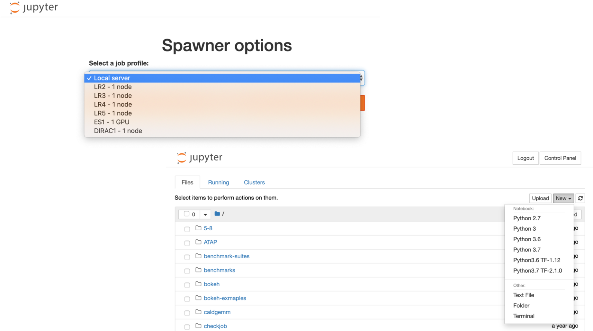
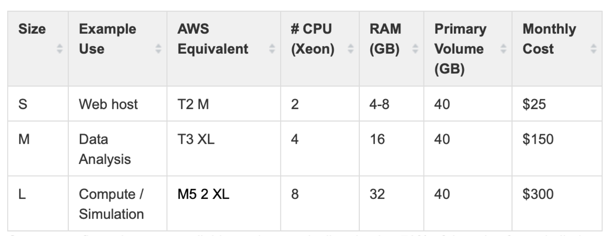

## Lawrencium Cluster Overview


[Detailed information of Lawrencium](https://sites.google.com/a/lbl.gov/high-performance-computing-services-group/lbnl-supercluster/lawrencium)

## [Accounts on Lawrencium](https://sites.google.com/a/lbl.gov/hpc/getting-an-account)

### Three types of Project Accounts
- PI Computing Allowance (PCA) account: free 300K SUs per year (pc_xxx)
- Condo account: PIs buy in compute nodes to the general condo pool (lr_xxx)
- Recharge account: with minimal recharge rate ~ $0.01/SU (ac_xxx)

### User accounts
- User account request
- User agreement consent 

[https://sites.google.com/a/lbl.gov/hpc/getting-an-account](https://sites.google.com/a/lbl.gov/hpc/getting-an-account)

## [Software Module Farm](https://sites.google.com/a/lbl.gov/high-performance-computing-services-group/getting-started/sl6-module-farm-guide)

### Module commands
- *module purge*: clear user’s work environment
- *module avail*: check available software packages
- *module load xxx*: load a package
- *module list*: check currently loaded software 
- Users may install their own software

[https://sites.google.com/a/lbl.gov/high-performance-computing-services-group/getting-started/sl6-module-farm-guide](https://sites.google.com/a/lbl.gov/high-performance-computing-services-group/getting-started/sl6-module-farm-guide)

## SLURM: Resource Manager & Job Scheduler
 
### Job Submission

- Get help with the complete command options
 ``` 
sbatch --help
 ```
- sbatch: submit a job to the batch queue system
```
sbatch myjob.sh
```
- srun: request an interactive node(s) and login automatically
```
srun -A ac_xxx -p lr5 -q lr_normal -t 1:0:0 --pty bash
```
- salloc : request an interactive node(s)
```
salloc –A pc_xxx –p lr6 –q lr_debug –t 0:30:0
```
## Job Monitoring

- sinfo: check status of partitions and nodes (idle, allocated, drain, down) 
 ```
 sinfo –r –p lr6
 ```
- squeue: check jobs in the batch queuing system (R or PD)
```
squeue –u $USER
```
- sacct: check job information or history
```
sacct -X -o 'jobid,user,partition,nodelist,stat'
```
- scancel : cancel a job
```
scancel jobID
```
- Check slurm association, such as qos, account, partition
```
sacctmgr show association user=UserName -p
perceus-00|ac_test|UserName|lr6|1||||||||||||lr_debug,lr_lowprio,lr_normal|||
perceus-00|ac_test|UserName|lr5|1||||||||||||lr_debug,lr_lowprio,lr_normal|||
perceus-00|pc_test|UserName|lr4|1||||||||||||lr_debug,lr_lowprio,lr_normal|||
perceus-00|lr_test|UserName|lr3|1||||||||||||lr_debug,lr_lowprio,lr_normal,te
perceus-00|scs|UserName|es1|1||||||||||||es_debug,es_lowprio,es_normal|||
```
[https://sites.google.com/a/lbl.gov/high-performance-computing-services-group/scheduler/slurm-usage-instructions](https://sites.google.com/a/lbl.gov/high-performance-computing-services-group/scheduler/slurm-usage-instructions)

## Data Transfer Node & [Visualization Node](https://sites.google.com/a/lbl.gov/high-performance-computing-services-group/getting-started/remote-desktop)

- Designate data transfer node **lrc-xfer.lbl.gov**
    - scp -r /your/source/file  $USER@lrc-xder.lbl.gov:/cluster/path
    - rsync -avzh /your/source/file $USER @lrc-xfer.lbl.gov:/cluster/path
- Globus Online provide secured unified interface for data transfer
    - endpoint lbn#lrc, Globus Connect, AWS S3 connector
- Visualization and remote desktop node **viz.lbl.gov**
    - Detailed information [click here](https://sites.google.com/a/lbl.gov/high-performance-computing-services-group/getting-started/remote-desktop)

## JupyterHub
[LRC JupyterHub](https://lrc-jupyter.lbl.gov)



## [Virtual Machine Services](https://commons.lbl.gov/display/itfaq/SVM+-+Virtual+Machine+Hosting)


More information of VM click [here](https://commons.lbl.gov/display/itfaq/SVM+-+Virtual+Machine+Hosting)
