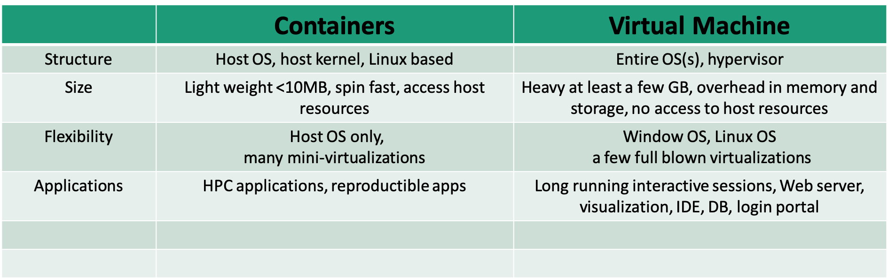

[Container 101 on Lawrencium; June 10, 2020;  Wei Feinstein](https://github.com/lbnl-science-it/container-101)

## Outline
- Container technology overview
- Build singularity containers
- Run singularity containers on Lawrencium

## Containerization
- Standardized packaging of software and dependencies
- Portable, shareable, and reproducible.
- Your application brings its environment with it.
- Share the same OS kernel

#### Applications 
- Package an analysis pipeline so that it runs on your laptop, in the cloud, and in HPC environment to produce the same result.
- Publish a paper and include a link to a container with all of the data and software that you used so that others can easily reproduce your results.
- Install and run an application that requires a complicated stack of dependencies
- Legacy codes require outdated OS

## Container vs. Virtual Machine


## Singularity Technology

- Open-source computer software that encapsulates an application and all its dependencies into a single image
- Bring containers and reproducibility to scientific computing and HPC
- Developed by Greg Kurtzer
- Typically users have a build system as root users, but may not be root users on a production system

## Docker

- Bring containerization to the community-scale
- Rich image repository
- Widely used by scientific communities
- Compose for defining multi-container, recipe/definition file to build docker images
- Security concerns not ideal for the HPC environment 

Learn more [docker](https://docs.docker.com/get-docker/) 

## Singularity Workflow

- Install Singularity on a local machine
- Build Singularity images locally with a root permission
- Transfer images to LRC clusters
- Run containers on the cluster
    - Root privilege is not permitted 
    
## Singularity Installation

OS platforms 
    
    - Linux
    - Mac
    - Window

Refer to instructions [here](https://github.com/lbnl-science-it/container-101/blob/master/singularity_installation_guide.md) for details

Test your installation:
```
$ singularity --version
  singularity version 3.2.1-1 
$ singularity run docker://godlovedc/lolcow
 ______________________________________
/ A tall, dark stranger will have more \
\ fun than you.                        /
 --------------------------------------
        \   ^__^
         \  (oo)\_______
            (__)\       )\/\
                ||----w |
                ||     ||
```

## Create Singularity Containers

- Build directly from pre-built docker images 
    - [Docker hub](https://hub.docker.com/search?q=&type=image) 
    - [Sylabs Cloud](https://cloud.sylabs.io/library) and [Singularity hub](https://singularity-hub.org/) 
- More involved using docker images from other external resources 
    - [Nvidia HPC containers](https://www.nvidia.com/en-us/gpu-cloud/containers/)
    - [Biocontainers](https://biocontainers.pro/#/registry)
    - [AWS](https://aws.amazon.com/releasenotes/available-deep-learning-containers-images/)
- Build using definition files or recipes 


## Singularity pull directly from docker:// & shub://

- No root/sudo privilege is needed
- Create/download immutable squashfs images/containers
```
singularity pull --help
```
- Docker Hub:  Pull a container from Docker Hub.
```
$ singularity pull docker://ubuntu:18.04 
$ singularity pull docker://gcc:7.2.0
```
- Singularity Hub:  If no tag is specified, the master branch of the repository is used
```
$ singularity pull hello-world.sif shub://singularityhub/hello-world
```

## Run Singularity with shell, run, exec

- **shell** sub-command: invokes an interactive shell within a container
```
singularity shell hello-world.sif
```
- **run** sub-command: executes the container’s runscript
```
singularity run hello-world.sif
```
- **exec** sub-command: execute an arbitrary command within container
```
singularity exec hello-world.sif cat /etc/os-release
```

## Singularity pull when Docker Containers Provided by Other External docker repositories

- [Nvidia HPC containers](https://www.nvidia.com/en-us/gpu-cloud/containers/)
- [Biocontainers](https://biocontainers.pro/#/registry)
- [AWS](https://aws.amazon.com/releasenotes/available-deep-learning-containers-images/)

## Steps to build singularity containers from NGC:

- Pull a docker image locally (e.g. pgi compiler from NGC)
```
$ docker pull nvcr.io/hpc/pgi-compilers:ce
.....

$ docker images
REPOSITORY                     TAG              IMAGE ID            CREATED             SIZE
nvcr.io/hpc/pgi-compiler        ce            c13ce6cf7f66        6 months ago        9.9GB
openmpi3.1                    latest          08a5518bb344        9 months ago        14.3GB
registry                         2            f32a97de94e1        15 months ago       25.8MB
...
```

## Steps to build singularity containers from NGC:

- Push to the Docker Hub (docker login) or simply use your local docker images 

- Singularity build from local registry
```
$ singularity build pgi.sif docker-daemon://nvcr.io/hpc/pgi-compilers:ce
$ ls
Dokerfile  hello-world.sif  pgi.sif  saxpy.c  Singularity
```
- Compile OpenACC code
```
$ singularity exec pgi.sif pgcc -o saxpy -acc -Minfo saxpy.c
saxpy:
      9, Loop is parallelizable
         Generating Tesla code
          9, #pragma acc loop gang, vector(128) /* blockIdx.x threadIdx.x */
      9, FMA (fused multiply-add) instruction(s) generated
...
```
- Execute binary ./saxpy
```
$ singularity exec pgi.sif ./saxpy
y[0] = 2.000000
```
Another example of using docker containers from [AWS](https://github.com/lbnl-science-it/singularity_aws_dl_container) 


## Singularity build

- Root/sudo privilege is needed
```
singularity build --help
```
- Build from a definition file
```
sudo singularity --debug build mycontainer.sif Singularity 
```

## Definition File/Recipe
```
Bootstrap: docker
#library, docker, shub, localimage, yum, debootstrap, arch, busybox, zypper 
From: ubuntu

## used singularity run-help 
%help
Hello. I'm in the container.

## executed on host after the base OS is installed.
%setup
    touch ${SINGULARITY_ROOTFS}/tacos.txt
    echo "I love avocado" >> avocados.txt

# copy files from your host system into the container 
%files
    avocados.txt /opt    

%environment
  export NAME=avocado

## executed within the container after the base OS is installed at build time
#install new software and libraries, config files,  directories, etc
%post
    echo 'export Avocado=TRUE' >> $SINGULARITY_ENVIRONMENT

## executed when the container image is run:  singularity run
%runscript 
    echo "Hello! Arguments received: $* \n"
    exec echo "$@"  
```
 More information of [singularity recipes](https://sylabs.io/guides/3.0/user-guide/definition_files.html)

## Singularity Build Rewritable Sandbox
- Can be built from a recipe or existing container 
- Used to develop, test, and make changes, then build or convert it into a standard image
```
sudo singularity build --sandbox gccbox docker://gcc:7.2.0
sudo singularity build --sandbox test-box Singularity 
```
- When you want to alter your image, you can use commands like shell, exec, run, with the --writable option
```
sudo singularity shell --writable test-box
```
- Convert a sandbox to an immutable final container:
```
sudo singularity build test-box.sif test-box
```
	
## Inspect Containers
- To check how a image is built, running script and environment variables.. 
```
singularity inspect [options] image_name
    --labels
    --runscript
    --deffile
    --environment
e.g. singularity inspect --deffile mycontainer.sif
```

## Singularity Python (spython)
- Python API for Singularity containers
- Convert Dockerfile to Singularity def
```
spython recipe Dockerfile > dock2sif.def
```

## Run Singularity Containers on Lawrencium
- File transfer to LRC cluster
```
scp xxx.sif $USER@lrc-xfer.lbl.gov:/your/path/on/cluster 
```
- Run your container interactively
	- Request an interactive compute node
	```
	singularity shell/run/exec container.sif
	```
- Submit a slurm job 

## Job Submission Example
```
#!/bin/bash -l
#SBATCH --job-name=container-test		 
#SBATCH --partition=lr5			 
#SBATCH --account=ac_xxx		 
#SBATCH --qos=lr_normal			
#SBATCH --nodes=1			
#SBATCH --time=1-2:0:0			

cd $SLURM_SUBMIT_DIR
singularity exec mycontainer.sif cat /etc/os-release
```

## Container Bind Path
- Singularity allow mapping directories on host to directories within container
- Easy data access within containers
- System-defined bind paths on LRC
	- /global/home/users/
	- /global/scratch/
- User can define own bind paths: 
- e.g.: mount  /host/path/ on the host to /container/path inside the container
```
-B /host/path/:/container/path

singularity run --nv -B /global/home/users/$USER:/tmp pytorch_19_12_py3.sif ls /tmp
```

## Run GPU Containers

- Singularity supports NVIDIA’s CUDA GPU compute framework or AMD’s ROCm solution
- --nv enables NVIDIA GPU support in Singularity
- Remember to request a GPU node from the ES1 partition
```
singularity exec --nv pytorch_19_12_py3.sif python -c "import torch; print(torch.__version__)"
1.4.0a0+a5b4d78
```
## Run MPI Containers

- If launch on multiple nodes, MPI libraries on the host and inside the container need to match 
- If launch on one node, only MPI library inside the container is called

## Exercise

- 1) singularity pull hello-world.sif shub://singularityhub/hello-world
- 2) generate hello-world.def or generate a sandbox to start with
- 3) add /data directory inside the container
- 4) build a new image hello-world-new.sif
- 5) bind /home/$USER on host to /data inside container
- 6) ls /data inside the new container  

## Getting help
- Virtual Office Hours:
    - Time: 10:30am - noon (Wednesdays) 
    - Request [online](https://docs.google.com/forms/d/e/1FAIpQLScBbNcr0CbhWs8oyrQ0pKLmLObQMFmYseHtrvyLfOAoIInyVA/viewform)
- Sending us tickets at hpcshelp@lbl.gov
- More information, documents, tips of how to use LBNL Supercluster [http://scs.lbl.gov/](http://scs.lbl.gov)
- DLab consulting: [https://dlab.berkeley.edu/consulting](https://dlab.berkeley.edu/consulting)

Please fill out [Training Survey](https://docs.google.com/forms/d/e/1FAIpQLSdrmW-7gZ8FankQwEceY6r_uXPmLHAuXFjDDfwu-86A1a0llg/viewform) to get your comments and help us improve.  


