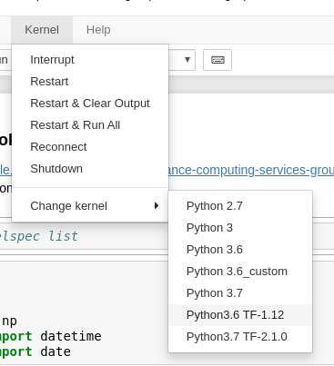

### [Jupyter Notebook via Jupyterhub](https://github.com/lbnl-science-it/Lawrencium/blob/master/jupyterhub_gpu.ipynb)
* https://sites.google.com/a/lbl.gov/high-performance-computing-services-group/getting-started/jupyter-notebook
* select __ES1__ partition for GPU


__Select a TensorFlow kernel__: `Python3.6 TF-1.12`




```python
import sys
import os
import getpass
import numpy as np
from datetime import datetime
from datetime import date
```


```python
system('hostname')
```
['n0009.es1']


```python
import tensorflow as tf
print(sys.version)
```

3.6.8 |Anaconda custom (64-bit)| (default, Dec 30 2018, 01:22:34) 
[GCC 7.3.0]


```python
print(tf.VERSION)
```

1.12.0


```python
print(date.today())
```

2020-05-21


#### Test if TF can access a GPU


```python
tf.test.is_gpu_available(
    cuda_only=False,
    min_cuda_compute_capability=None
)

```

True


#### Print the name of the GPU device

```python
tf.test.gpu_device_name()
```

'/device:GPU:0'


__Run the code on a GPU or CPU__


```python
device_name = tf.test.gpu_device_name()
#device_name = '/device:CPU:0'
shape = (3000, 3000)
with tf.device(device_name):
    random_matrix = tf.random_uniform(shape=shape, minval=0, maxval=1)
    dot_operation = tf.matmul(random_matrix, tf.transpose(random_matrix))
    sum_operation = tf.reduce_sum(dot_operation)
startTime = datetime.now()
with tf.Session(config=tf.ConfigProto(log_device_placement=True)) as session:
        result = session.run(sum_operation)
        print(result)

print("Shape:", shape, "Device:", device_name)
print("Time taken:", datetime.now() - startTime)
```

6750205000.0
Shape: (3000, 3000) Device: /device:GPU:0
Time taken: 0:00:00.043736


```python
#device_name = tf.test.gpu_device_name()
device_name = '/device:CPU:0'
shape = (3000, 3000)
with tf.device(device_name):
    random_matrix = tf.random_uniform(shape=shape, minval=0, maxval=1)
    dot_operation = tf.matmul(random_matrix, tf.transpose(random_matrix))
    sum_operation = tf.reduce_sum(dot_operation)
startTime = datetime.now()
with tf.Session(config=tf.ConfigProto(log_device_placement=True)) as session:
        result = session.run(sum_operation)
        print(result)

print("Shape:", shape, "Device:", device_name)
print("Time taken:", datetime.now() - startTime)
```

6749143000.0
Shape: (3000, 3000) Device: /device:CPU:0
Time taken: 0:00:00.765788

