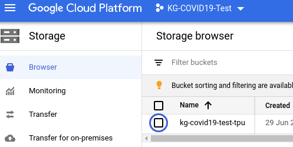
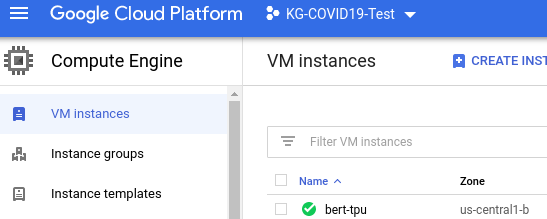
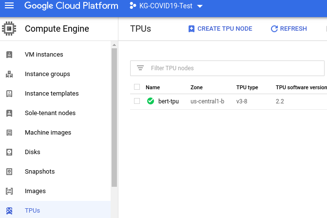

# BERT FineTuning with Google Cloud TPU: Sentence and Sentence-Pair Classification Tasks (TensorFlow 2.2)

A modified version of this GCP tutorial: [https://cloud.google.com/tpu/docs/tutorials/bert-2.x](https://cloud.google.com/tpu/docs/tutorials/bert-2.x)

## Overview
This tutorial shows you how to train the Bidirectional Encoder Representations from Transformers (BERT) model on Cloud TPU.

BERT is a method of pre-training language representations. Pre-training refers to how BERT is first trained on a large source of text, such as Wikipedia. You can then apply the training results to other Natural Language Processing (NLP) tasks, such as question answering and sentiment analysis. With BERT and Cloud TPU, you can train a variety of NLP models in about 30 minutes.

## Objectives

* Create a Cloud Storage bucket to hold your dataset and model output.
* Run the training job.
* Verify the output results.

## Costs

This tutorial uses billable components of Google Cloud, including:

* Compute Engine -> VM Instances
* Compute Engine -> TPUs
* Cloud Storage


## Cloud Storage Bucket

Important: Set up your Compute Engine VM, Cloud TPU node, and Cloud Storage bucket in the same region/zone to reduce network latency and network costs.

Open __Cloud Shell__: create variables for the Project `PROJECT_ID`, Cloud Storage `BUCKET_NAME`, and TPU_NAME`, and create a Cloud Storage bucket using the following commands:

```
export PROJECT_ID=$(gcloud info --format='value(config.project)')
export BUCKET_NAME=${PROJECT_ID}-tpu
export TPU_NAME=bert-tpu

echo $PROJECT_ID
echo $BUCKET_NAME
echo $TPU_NAME

gsutil mb -p ${PROJECT_ID} -c standard -l us-central1 -b on gs://$BUCKET_NAME
```
This Cloud Storage bucket stores the data you use to train your model and the training results. 


## Compute Engine VM and Cloud TPU

The Compute Engine (VM) and your Cloud TPU node location must be in the same region as your bucket location.

* Launch a Compute Engine VM and Cloud TPU using the __`ctpu up`__ command, and enter __Y__ to approve:

```
ctpu up --tpu-size=v3-8 \
  --name=$TPU_NAME \
  --machine-type=n1-standard-8 \
  --zone=us-central1-b \
  --tf-version=2.2 \
  --project=$PROJECT_ID
```
__Note__: you must specify the project ID with the __`--project`__ flag.

Output from `ctpu up`:
```
ctpu will use the following configuration:

  Name:                 bert-tpu
  Zone:                 us-central1-b
  GCP Project:          kg-covid19-test
  TensorFlow Version:   2.2
  VM:
      Machine Type:     n1-standard-8
      Disk Size:        250 GB
      Preemptible:      false
  Cloud TPU:
      Size:             v3-8
      Preemptible:      false
      Reserved:         false

OK to create your Cloud TPU resources with the above configuration? [Yn]: Y
2020/06/29 19:01:47 Creating TPU bert-tpu (this may take a few minutes)...
2020/06/29 19:01:47 Creating Compute Engine VM bert-tpu (this may take a minute)...
2020/06/29 19:01:53 TPU operation still running...
2020/06/29 19:01:54 Created Compute Engine VM bert-tpu!
2020/06/29 19:02:14 TPU operation still running...
2020/06/29 19:02:34 TPU operation still running...
2020/06/29 19:02:54 TPU operation still running...
2020/06/29 19:03:14 TPU operation still running...
2020/06/29 19:03:19 Created TPU bert-tpu!
About to ssh (with port forwarding enabled -- see docs for details)...
Warning: Permanently added 'compute.1150743958340969443' (ECDSA) to the list of known hosts.
bind [::1]:6006: Cannot assign requested address
bind [::1]:8888: Cannot assign requested address
bind [::1]:8470: Cannot assign requested address
bind [::1]:8466: Cannot assign requested address
Linux bert-tpu 4.19.0-8-cloud-amd64 #1 SMP Debian 4.19.98-1 (2020-01-26) x86_64

The programs included with the Debian GNU/Linux system are free software;
the exact distribution terms for each program are described in the
individual files in /usr/share/doc/*/copyright.

Debian GNU/Linux comes with ABSOLUTELY NO WARRANTY, to the extent
permitted by applicable law.
username@bert-tpu:~$ 
```
__Note__: when the `ctpu up` command has finished executing, you will be automatically logged into your Compute Engine VM (your shell prompt has changed to __`username@bert-tpu`__) As you continue these instructions, run each command in your VM session window (__`username@bert-tpu`__) 

* Run __`ctpu status`__ to make sure the cluster (__Compute Engine VM__ and __Cloud TPU__) is running:
```
ctpu status --name=bert-tpu --zone=us-central1-b
```

```
Your cluster is running!
	Compute Engine VM:  RUNNING
	Cloud TPU:          RUNNING
```

Compute Engine -> VM Instances



Compute Engine -> TPUs



## Define parameter values and Prepare the Dataset

* From Compute Engine VM, create environment variables and prepare the dataset
```
export PROJECT_ID=$(gcloud info --format='value(config.project)')
export BUCKET_NAME=${PROJECT_ID}-tpu
export TPU_NAME=bert-tpu

sudo pip3 install -r /usr/share/models/official/requirements.txt
```

Note: The Compute Engine VM has model code pre-downloaded from [GitHub](https://github.com/tensorflow/models).
```
Requirement already satisfied: six in /usr/local/lib/python3.7/dist-packages (from -r /usr/share/models/official/requirements.txt (line 1)) (1.14.0)
Requirement already satisfied: google-api-python-client>=1.6.7 in /usr/local/lib/python3.7/dist-packages (from -r /usr/share/models/official/requirements.txt (line 2)) (1.8.2)
Collecting google-cloud-bigquery>=0.31.0
  Downloading google_cloud_bigquery-1.25.0-py2.py3-none-any.whl (169 kB)
     |████████████████████████████████| 169 kB 3.4 MB/s 
...
Successfully installed Cython-0.29.20 dataclasses-0.6 dm-tree-0.1.5 google-cloud-bigquery-1.25.0 google-cloud-core-1.3.0 google-resumable-media-0.5.1 kaggle-1.5.6 mlperf-compliance-0.0.10 opencv-python-headless-4.2.0.34 pandas-1.0.5 psutil-5.7.0 py-cpuinfo-6.0.0 pycocotools python-slugify-4.0.0 sentencepiece-0.1.91 tensorflow-addons-0.10.0 tensorflow-model-optimization-0.3.0 text-unidecode-1.3 typeguard-2.9.1 typing-3.7.4.1 urllib3-1.24.3

```


* Define several parameter values that are required when you train and evaluate your model

```
export STORAGE_BUCKET=gs://$BUCKET_NAME

export PYTHONPATH="${PYTHONPATH}:/usr/share/models"
export BERT_BASE_DIR=gs://cloud-tpu-checkpoints/bert/keras_bert/uncased_L-24_H-1024_A-16
export MODEL_DIR=${STORAGE_BUCKET}/bert-output
export GLUE_DIR=gs://cloud-tpu-checkpoints/bert/classification
export TASK=mnli
```

## Train the model

From your Compute Engine VM, run the following command:
```
python3 /usr/share/models/official/nlp/bert/run_classifier.py \
  --mode='train_and_eval' \
  --input_meta_data_path=${GLUE_DIR}/${TASK}_meta_data \
  --train_data_path=${GLUE_DIR}/${TASK}_train.tf_record \
  --eval_data_path=${GLUE_DIR}/${TASK}_eval.tf_record \
  --bert_config_file=${BERT_BASE_DIR}/bert_config.json \
  --init_checkpoint=${BERT_BASE_DIR}/bert_model.ckpt \
  --train_batch_size=32 \
  --eval_batch_size=32 \
  --learning_rate=2e-5 \
  --num_train_epochs=1 \
  --model_dir=${MODEL_DIR} \
  --distribution_strategy=tpu \
  --tpu=${TPU_NAME}
```

## Verify your results

The training takes approximately 2 minutes on a v3-8 TPU. When script completes, you should see results similar to the following:

```
...
INFO:tensorflow:Found TPU system:
I0630 02:46:58.561566 139942479124288 tpu_system_metadata.py:140] Found TPU system:
INFO:tensorflow:*** Num TPU Cores: 8
I0630 02:46:58.561764 139942479124288 tpu_system_metadata.py:141] *** Num TPU Cores: 8
INFO:tensorflow:*** Num TPU Workers: 1
I0630 02:46:58.561963 139942479124288 tpu_system_metadata.py:142] *** Num TPU Workers: 1
INFO:tensorflow:*** Num TPU Cores Per Worker: 8
I0630 02:46:58.562026 139942479124288 tpu_system_metadata.py:144] *** Num TPU Cores Per Worker: 8
...
I0630 03:04:41.019742 139942479124288 model_training_utils.py:444] Train Step: 12271/12271  / loss = 0.39529433846473694  test_accuracy = 0.856514
I0630 03:04:41.019939 139942479124288 model_training_utils.py:458] Running evaluation after step: 12271.
I0630 03:04:59.298659 139942479124288 model_training_utils.py:372] Step: [12271] Validation test_accuracy = 0.855834
I0630 03:05:48.766718 139942479124288 model_training_utils.py:48] Saving model as TF checkpoint: gs://kg-covid19-test-tpu/bert-output/ctl_step_12271.ckpt-1
I0630 03:05:48.766959 139942479124288 model_training_utils.py:472] Running final evaluation after training is complete.
I0630 03:05:54.593996 139942479124288 model_training_utils.py:372] Step: [12271] Validation test_accuracy = 0.855834
Training Summary: 
{'total_training_steps': 12271, 'train_loss': 0.39529433846473694, 'last_train_metrics': 0.8565140962600708, 'eval_metrics': 0.8558338284492493}
```
To increase accuracy, set --num_tain_epochs=3. The script will take approximately one hour to train.

## Clean up

* __Disconnect from the Compute Engine VM__.
```
exit
```
Your prompt should now be username@projectname, showing you are in the Cloud Shell.

* __Delete Compute Engine VM and Cloud TPU__. In your Cloud Shell, run `ctpu status` to check the running instances, and then run `ctpu delete` to delete both VM and Cloud TPU. Run `ctpu status` again to make sure you have no instances allocated to avoid unnecessary charges for TPU usage. 

```
ctpu status --name=$TPU_NAME --zone=us-central1-b

ctpu delete --name=$TPU_NAME --zone=us-central1-b

ctpu status --name=$TPU_NAME --zone=us-central1-b
```

The deletion might take several minutes. A response like the one below indicates there are no more allocated instances:
```
Your cluster is running!
        Compute Engine VM:  RUNNING
        Cloud TPU:          RUNNING

ctpu will use the following configuration values:
        Name:          bert-tpu
        Zone:          us-central1-b
        GCP Project:   kg-covid19-test
About to permanently delete your resources. Ok? [Yn]: Y
2020/06/29 20:36:30 Deleting TPU bert-tpu...
2020/06/29 20:36:30 Deleting Compute Engine VM "bert-tpu"...
All "delete" operations have been initiated successfully. They will
run to completion even if you kill ctpu (e.g. by pressing Ctrl-C). When the
operations have finished running, ctpu will exit. If you would like your shell
back, you can press Ctrl-C now. Note: Next time you run ctpu, you can pass the
--nowait flag to get your shell back immediately.
2020/06/29 20:36:36 TPU operation still running...
2020/06/29 20:36:36 Compute Engine operation still running...
2020/06/29 20:36:56 TPU operation still running...
2020/06/29 20:37:17 TPU operation still running...
2020/06/29 20:37:37 TPU operation still running...
2020/06/29 20:37:57 TPU operation still running...
ctpu delete completed successfully.

No instances currently exist.
        Compute Engine VM:  --
        Cloud TPU:          --
```

* __Remove the Cloud Storage bucket__. Run gsutil to remove the Cloud Storage bucket you created for this tutorial:

```
gsutil rm -r gs://$BUCKET_NAME
```

## References
* https://cloud.google.com/tpu/docs/tutorials/bert-2.x
* https://cloud.google.com/tpu/docs/quickstart
* https://github.com/tensorflow/models/tree/master/official/nlp/bert